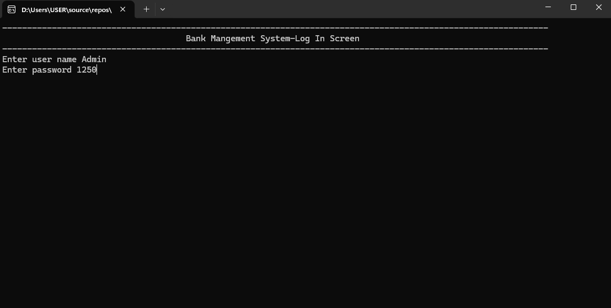
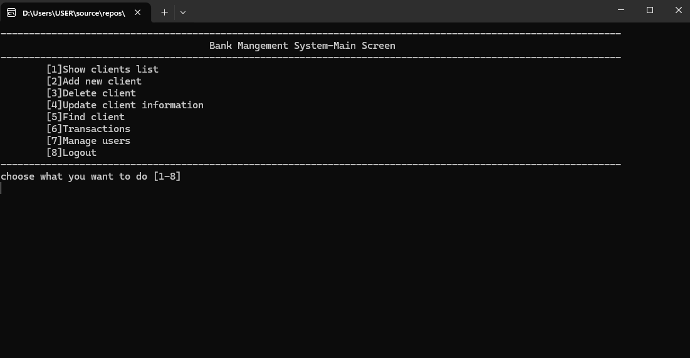
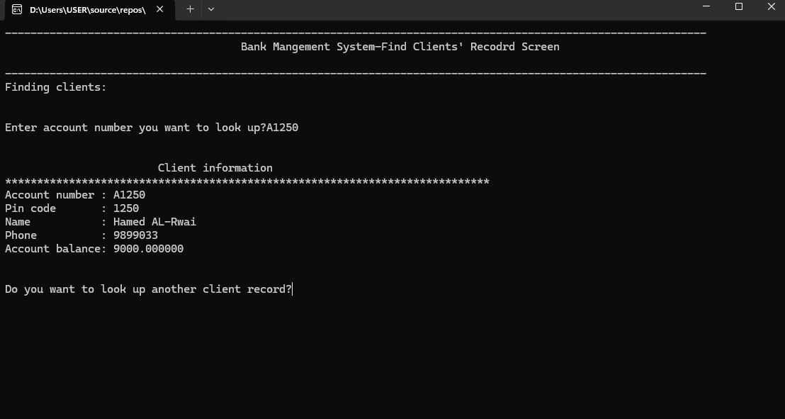
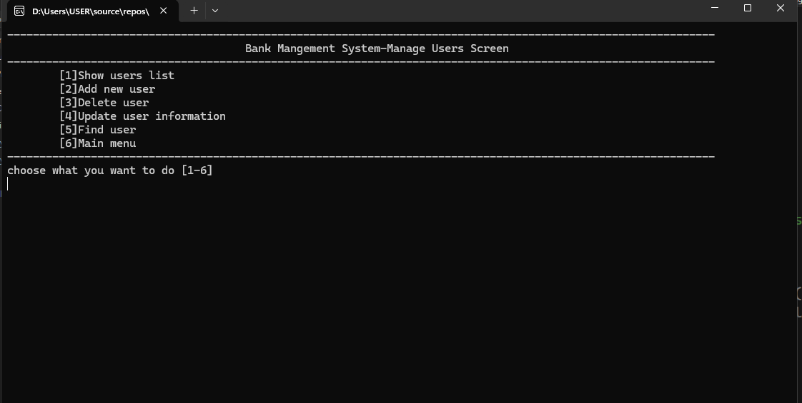

🏦 Simple Banking Management System

A console-based C++ application that simulates a simple banking management system.This project uses plain text files (.txt) as a lightweight "database" to store and retrieve client and user information.

📖 Features

🔐 User Authentication (login with username & password)

👥 Client Management

Show clients list

Add new client

Delete client

Update client information

Find client by account number

💳 Transactions

Deposit / Withdraw

Balance inquiry

👤 User Management

Show users list

Add new user

Delete user

Update user information

Find user

🚪 Logout functionality

🛡️ **Role-Based Authorization**
  - **Admin banker**: Full access to all system features (client management, transactions, user management).
  - **Regular banker**: Limited access, restricted from certain administrative tasks.

🛠️ Technologies Used

C++ (Core language)

Text files (.txt) for persistent storage

Command-line interface (CLI) for interaction

🚀 Getting Started

Option A: Using Terminal (cross‑platform)

Clone the repository

git clone git@github.com:HAJS78/Simple-Banking-Mangement-System.git

Compile the program

g++ course_8_Project_1.cpp -o BankSystem

This compiles the source file into an executable named BankSystem.

Run the executable

./BankSystem

This launches the text‑based banking system in your terminal.

Option B: Using Visual Studio (Windows workflow)

Clone the repository (same as above).

Open the solution file

Navigate to the project folder.

Double‑click course_8_Project_1.sln or open it from within Visual Studio.

Build and run inside Visual Studio

## 🖼️ Screenshots

### Log In Screen

### Main Menu Screen

### Show Clients List Screen

### Find Client Record Screen

### Manage Users Screen

📌 Notes

All data is stored in .txt files for simplicity.
   bank_records_new.txt (for clients data)
   bank_system_user_records.txt (for bank employee data)

This project is intended for educational purposes and demonstrates basic file handling and CLI design in C++.

It is not intended for production banking use.

📜 License

This project is licensed under the MIT License — feel free to use, modify, and share 

## 📅 Timeline
- Started: June 2024  
- Completed: June 2024